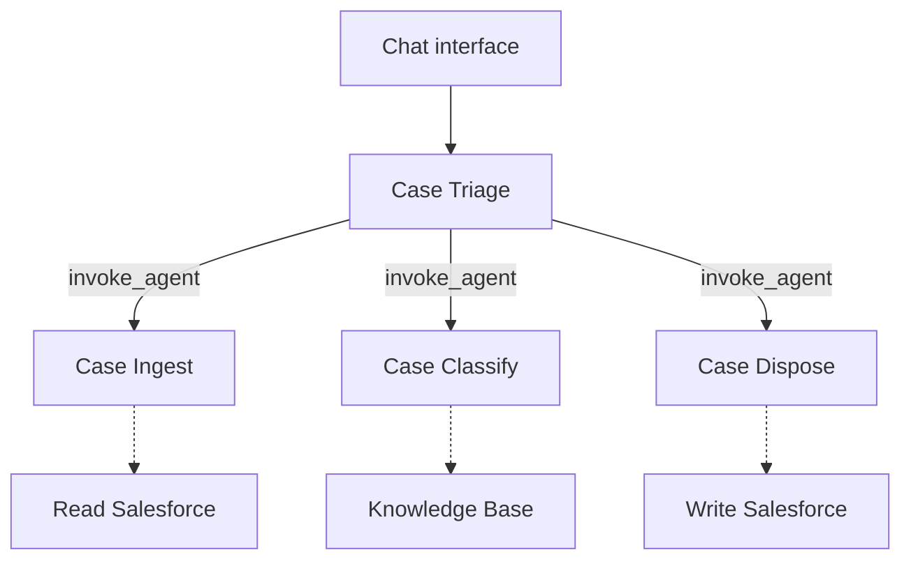

# Salesforce Case Triage

## Architecture



The orchestrator has no direct Salesforce access. Salesforce tools run on the hosted runtime with the project's service account, and case data is PII-redacted before classification.

## User flow

1. Install dependencies with `npm install`.
2. Create local hosted-control-plane configuration:

   ```bash
   cp .env.example .env.local
   ```

   Set `VERYFRONT_API_TOKEN` in `.env.local`.

3. Push the current project files for hosted child runs:

   ```bash
   npx veryfront push
   ```

4. Run `npm run dev` and open <http://veryfront.me:3000>.
5. Select **Triage latest open cases**.

`npm run dev` serves the app and parent agent runtime locally. In this setup,
`invoke_agent` creates child runs through the hosted control plane. Child agents
use the pushed project files, while integrations and their service identities
execute hosted. Push again after changing files that a child agent must use.
