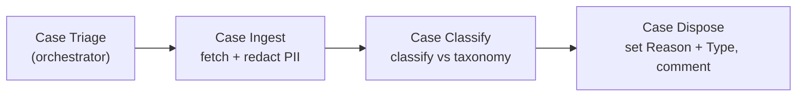

# Agentic Case Processing

An AI template, built on [Veryfront](https://veryfront.com), that triages new
Salesforce Service Cloud cases on a schedule. For each new case it assigns a
category and type, names the team that should own it, sets the case `Reason` and
`Type`, and records the verdict as a private case comment with a confidence score.

It runs against a **standard Salesforce org**. The `Reason` and `Type` values are
the standard Salesforce Case picklists, so there are no custom fields to create
and no configuration to change — connect an org and it works.

## How it works

Four agents run as a pipeline. An orchestrator coordinates the run; three
specialists each handle one step with the minimum access that step requires.



| Agent | Responsibility | Salesforce access |
|---|---|---|
| `case-triage` | Orchestrates the run and delegates each step | None |
| `case-ingest` | Fetches the case and redacts PII | Read-only |
| `case-classify` | Classifies against the taxonomy | None |
| `case-dispose` | Sets `Reason` + `Type`, posts the comment | Comment + those two fields |

Each step runs in an isolated context via `invoke_agent`. The raw case body —
untrusted text that may contain PII — is read by Ingest and Classify and never
reaches the orchestrator, which sees only a structured verdict.

## What it writes

Each run posts one private comment on the case:

```
[Triage] Performance → Degraded output
Customer reports the generator is producing below its rated output under load.
Suggested team: Field Engineering

----
category:    Performance
subcategory: Degraded output
reason:      Performance
type:        Mechanical
confidence:  0.88
team:        Field Engineering
taxonomy:    v1
agent:       case-triage/2026-08-12T09:15Z
```

The comment is written with `IsPublished: false`, so it stays internal. The
metadata block below the rule is a stable contract for reporting and measuring
accuracy.

## Safety model

- **Least privilege.** `case-dispose` can add a comment and set the `Reason` and
  `Type` fields, and nothing else. It cannot reassign, close, or reprioritise a
  case, because it has no tool for those operations — the limit is enforced by
  tool registration, not by a prompt.
- **PII containment.** `case-ingest` redacts names, emails, phone numbers, and
  addresses before any text reaches classification or a written comment.
- **Private comments.** Confidence scores are never surfaced to a customer.

## Prerequisites

- A Salesforce org with API access (a free
  [Developer Edition](https://developer.salesforce.com/signup) org works).
- A Veryfront account and a project API token.

## Run it

```bash
npm install
cp .env.example .env.local   # set VERYFRONT_API_TOKEN
npx veryfront push           # push project files for hosted child runs
npm run dev                  # serves the app + parent agent runtime locally
```

Open the app, connect Salesforce when prompted (OAuth, via the Veryfront
Integrations panel — the connection uses an integration user; credentials are
held by the platform and never enter an agent's context), and select
**Triage latest open cases**.

To run it unattended, `schedules/triage-new-cases.ts` runs the `case-triage`
agent every 10 minutes. Adjust the cron expression or timezone, then push the
project to activate it.

## Evaluate

```bash
npm run eval
```

Evals target the same agent definitions and check tool behaviour and output
shape for each step (`evals/case-*.eval.ts`).

## Project layout

```
agents/      case-triage (orchestrator), case-ingest, case-classify, case-dispose
knowledge/   case-triage-taxonomy.md — the classification + routing spec
evals/       one eval per agent, plus mock tools
schedules/   triage-new-cases.ts — runs case-triage every 10 minutes
app/         chat UI and AG-UI route
```

## License

[Apache-2.0](./LICENSE).
