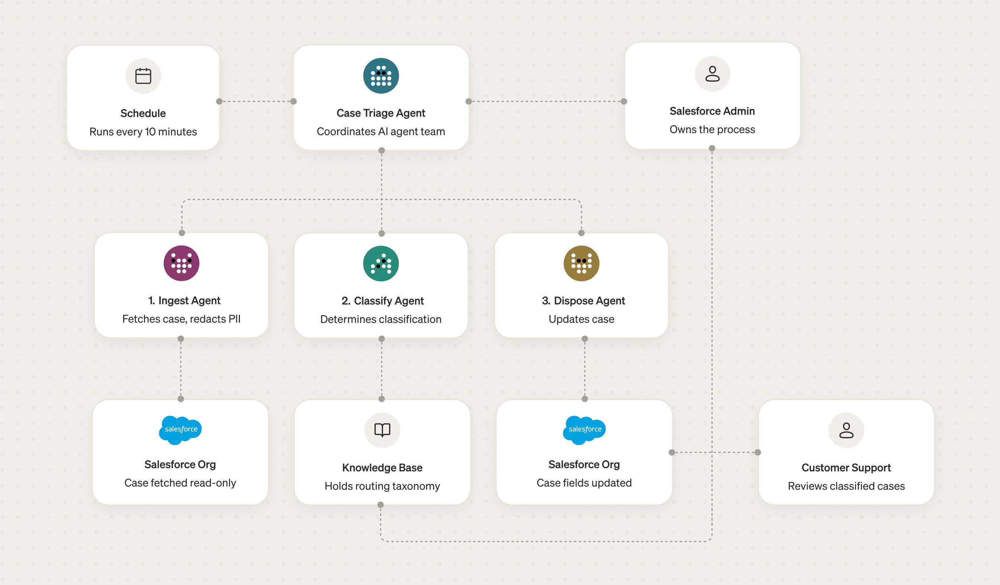

# Agentic Case Processing

A [Veryfront](https://veryfront.com) template that triages new Salesforce cases with an agentic
workforce, on a schedule. For each new case it assigns a category and type from your service
taxonomy, names the team that should own it, sets the case `Reason` and `Type` fields, and records
the verdict as a private case comment with a confidence score.



## Prerequisites

Use Node.js 22.18 or later.

## Authentication

Authenticate with Veryfront:

```bash
npx veryfront login
```

Or copy `.env.example` to `.env` and set `VERYFRONT_API_TOKEN` from [your API keys](https://veryfront.com/settings/api-keys).

## Getting started

Install the dependencies and start the app locally.

```bash
npm i
npm run dev
```

## Deploy to Veryfront Cloud

Move the project from local to a cloud preview, promote it to production, and run the case-triage workflow on a schedule.

```bash
npx veryfront up       # create a project
npx veryfront push     # push changes
npm run deploy         # promote the preview to production
```

Fork this template in [Veryfront Studio](https://new.veryfront.com/?template=agentic-case-processing-salesforce&agent=case-triage).

## Eval

Four behavior evals, one per agent, with mocked tools. Requires [authentication](#authentication), a [cloud project](#deploy-to-veryfront-cloud), and credits.

```bash
npm run eval
```

## License

Licensed under the [Apache License 2.0](LICENSE).
