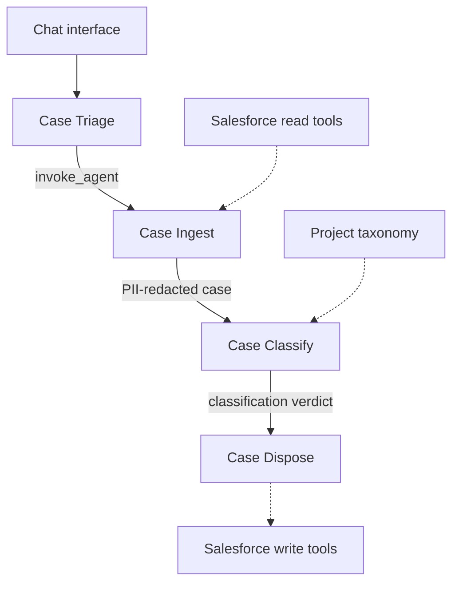

# Salesforce Case Triage

## Architecture



The orchestrator has no direct Salesforce access. Salesforce tools run on the hosted runtime with the project's service account, and case data is PII-redacted before classification.

## User flow

1. Install dependencies with `npm install`.
2. Configure the hosted runtime:

   ```bash
   export VERYFRONT_API_TOKEN="<your-token>"
   export VERYFRONT_PROJECT_SLUG="agentic-case-processing"
   export VERYFRONT_API_BASE_URL="https://api.veryfront.org"
   export VERYFRONT_API_URL="https://api.veryfront.org"
   export VERYFRONT_HOST_ALLOW_INTERNAL_EGRESS=1
   ```

3. Run `npm run dev` and open <http://veryfront.me:3000>.
4. Select **Triage latest open cases**.

The chat and agents run locally. Salesforce tools run on the hosted Veryfront API using the project's configured service account.
